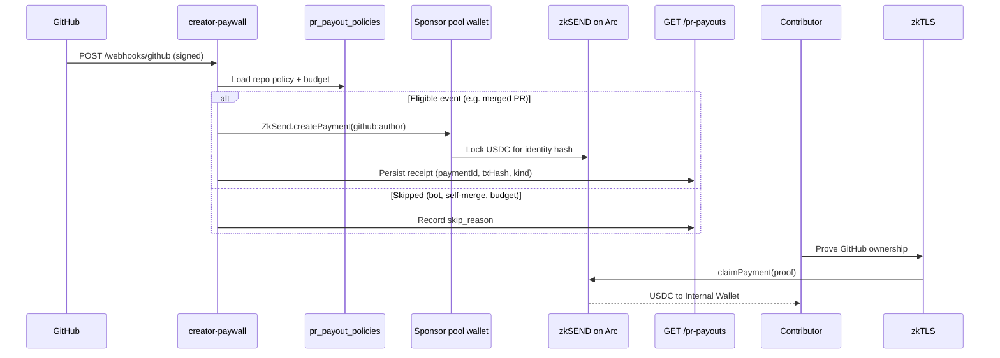
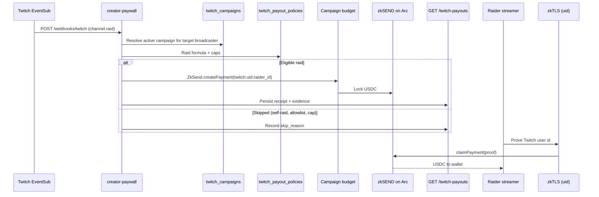

# Agent Treasury

Autonomous USDC settlement for **GitHub repo treasury** and **Twitch raid-to-pay**, built on Arc Testnet via `ZkSend.createPayment` to a **social identity** (not a wallet address). Sponsors fund a pool; the backend pays contributors when eligible events fire; recipients claim later with zkTLS proof.

For the full Sendly product (gift cards, zkTLS direct payments, bridge, gateway), see [Architecture](./Architecture.md).

## Scope

**In scope for this document:**

- GitHub Agent Workflow (webhook → policy → payout → receipts → claim)
- Twitch Agent Workflow (EventSub raid → campaign policy → payout → receipts → uid claim)
- Agent discovery (`llms.txt`, `openapi.json`, `/lepton-hackathon`)
- Architectural decisions and source-of-truth matrix
- Brief platform support (zk OAuth claim on the zk host)

**Explicitly out of scope:**

- Creator paywall (HTTP 402 article unlock) - separate product surface
- Citation demo - not product-documented here
- In-file OpenSpec requirement → code traceability tables - see [OpenSpec Traceability](./OpenSpec-Traceability.md)

## Architectural Decisions

| Decision | Choice |
|---|---|
| Identity stacks | **Privy** and **zk OAuth** remain **parallel forever** on different hosts; no migration from one to the other |
| Backend today | Single Edge Function `creator-paywall` in `sendly-supabase` (GitHub + Twitch + discovery APIs) |
| Backend future | Split into **one function per capability** when the surface area grows |
| Database & migrations | Source of truth: **`sendly-supabase`** |
| Agent machine docs | Source of truth: `sendly-supabase/functions/arc/creator-paywall/llm.txt` and `openapi.json`, synced to frontend `public/` at build time |
| Settlement rail | Reuse existing `ZkSend` contract and zkTLS claim - no new on-chain protocol for treasury |

## Source of Truth

| Concern | Repository | Path |
|---|---|---|
| Webhook handlers, payout logic, API routes | `sendly-supabase` | `functions/arc/creator-paywall/` |
| DB migrations (policies, receipts, campaigns) | `sendly-supabase` | `supabase/migrations/` |
| Agent operational guide | `sendly-supabase` → synced | `llm.txt` → `public/llm.txt`, `public/llms.txt` |
| OpenAPI spec | `sendly-supabase` → synced | `openapi.json` → `public/openapi.json` |
| Build-time doc sync | Sendly-App | `scripts/sync-agent-docs.mjs` |
| Human treasury UI (Lepton) | Sendly-App | `/lepton/*`, `src/components/lepton/`, `src/lib/paywall/*PayoutAPI.ts` |
| Recipient claim UI | Sendly-App | `PendingPayments`, `lib/zk-oauth/`, `lib/reclaim/` |
| zkTLS Twitch uid proof | `zktls-service` | Twitch provider (`twitch:uid:{id}` context) |

Production agent doc URLs (zk host): `https://sendly.digital/llms.txt`, `https://sendly.digital/openapi.json`.

Base API URL: `https://eiiprokgcuksmunmszxf.supabase.co/functions/v1/creator-paywall`.

## GitHub Agent Workflow

Maintainers configure a **repo payout policy**. Eligible GitHub events trigger autonomous USDC payouts to `github:{author_login}` from a **sponsor pool** (Circle developer wallet). The contributor does not need a wallet upfront.

**Payout kinds** (same settlement rail): merge, issue bounty, release dividend, review-to-earn.

**Key endpoints:**

| Step | Method | Path |
|---|---|---|
| Configure policy | `POST` | `/pr-payout-policy` |
| List policies | `GET` | `/pr-payout-policy` |
| Webhook ingress | `POST` | `/webhooks/github` |
| Public receipts | `GET` | `/pr-payouts` |
| Issue bounties (open) | `GET` | `/repo-bounties` |

**Webhook security:** `X-Hub-Signature-256` (HMAC-SHA256) must validate before any payout logic.

**Supported events:** `pull_request`, `issues`, `release`, `pull_request_review`.

**Human UI:** `/lepton` (hub), `/lepton/receipts`, `/lepton/pr-bounty`, `/lepton/repo-settings`.

## Twitch Agent Workflow

**Raid-to-Pay:** when broadcaster Alice is raided by Bob, the system pays **the raiding streamer** at canonical identity `twitch:uid:{from_broadcaster_user_id}`. Login is a display snapshot only.

**Payout formula:** `amount = min(viewers × rate_per_viewer, max_per_event)`, subject to `min_viewers`, daily caps, and campaign budget.

**Key endpoints:**

| Step | Method | Path |
|---|---|---|
| Create campaign | `POST` | `/twitch/campaigns` |
| List campaigns | `GET` | `/twitch/campaigns` |
| Upsert raid policy | `POST` | `/twitch/payout-policy` |
| List policies | `GET` | `/twitch/payout-policies` |
| Webhook ingress | `POST` | `/webhooks/twitch` |
| Public receipts | `GET` | `/twitch-payouts` |
| Identity lookup | `GET` | `/twitch/identity/{userId}` |

**Webhook security:** `Twitch-Eventsub-Message-Signature` over `message_id + timestamp + raw_body`.

**Human UI:** `/lepton/twitch/campaign`, `/lepton/twitch/receipts`.

## Agent Discovery

External agents should not scrape the frontend repo for API contracts. Use the published machine docs:

| Resource | URL (production) | Purpose |
|---|---|---|
| Agent guide | `/llms.txt` | Settlement rules, webhook flows, identity formats, demo amounts |
| OpenAPI | `/openapi.json` | Machine-readable paths and schemas |
| Resource catalog | `GET /lepton-hackathon` | JSON index of agent-facing endpoints + settlement metadata |

**Sync to frontend:** `npm run build` runs `sync:agent-docs` first. If a local `sendly-supabase/.../creator-paywall` checkout exists, `llm.txt` and `openapi.json` are copied into `public/`; otherwise the committed `public/` copies are used. In CI, stale local copies must not overwrite committed docs.

This document is the **human architecture** layer. Operational detail (curl examples, field names, demo policies) lives in `llms.txt`.

## Platform Support (Claim Path)

Agent treasury creates **pending** `ZkSend` payments. Recipients claim through the same zkTLS rail as direct zkSEND payments.

On the **zk host** (`sendly.digital`), users connect social accounts via **zk OAuth** (local token storage), not Privy. Wallet resolution tries connected EOA first, then zk OAuth social identity, then Privy-linked social on other hosts. See [Identity and Wallet Resolution](./Architecture.md#identity-and-wallet-resolution) in Architecture.md.

Twitch treasury requires **uid-aware** claim: identity hash `keccak256("twitch:uid:{user_id}")`, proved via `zktls-service` and claimed in `PendingPayments`.

## Future: Function Split

Today all agent treasury APIs live in one Edge Function (`creator-paywall`). The planned evolution is **one Supabase function per capability** (e.g. `github-treasury`, `twitch-treasury`, `agent-discovery`) with shared settlement helpers. Until then, route prefixes and OpenAPI tags document logical boundaries.
