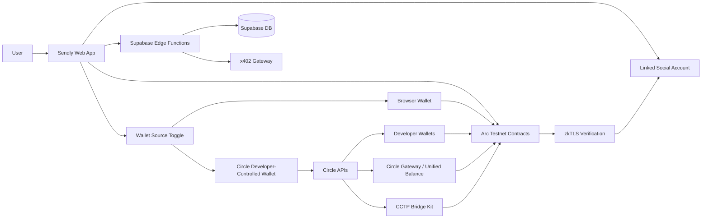
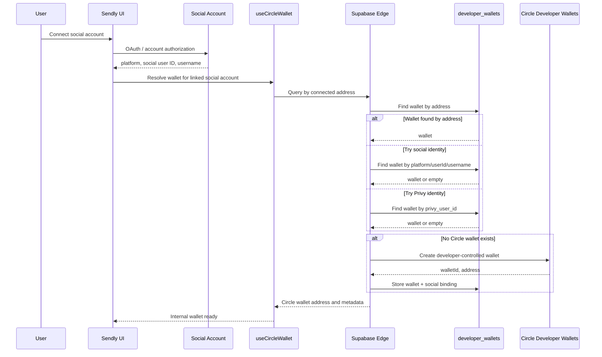
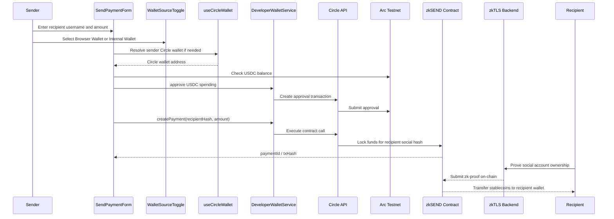
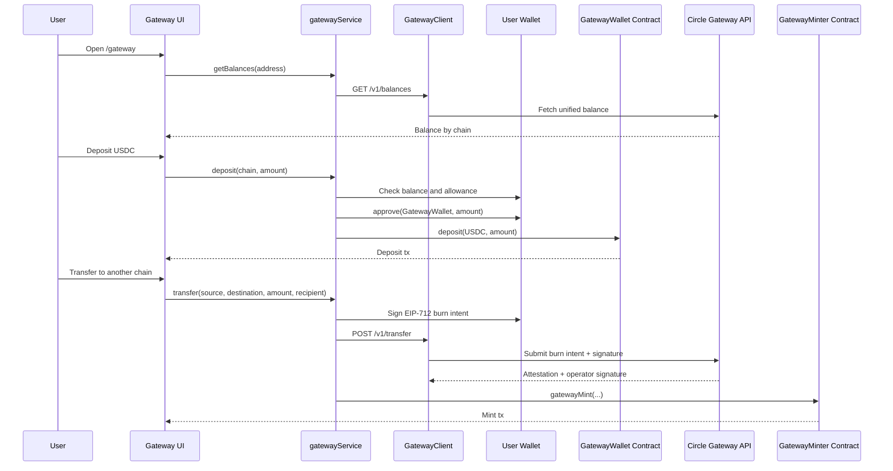
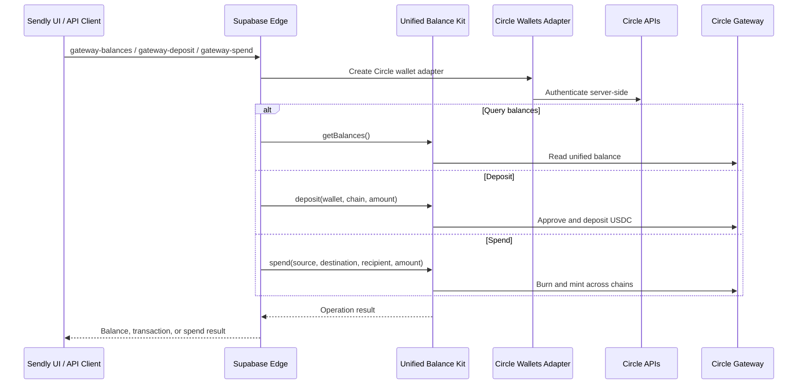
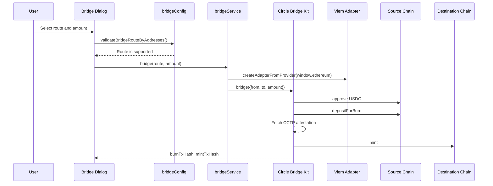
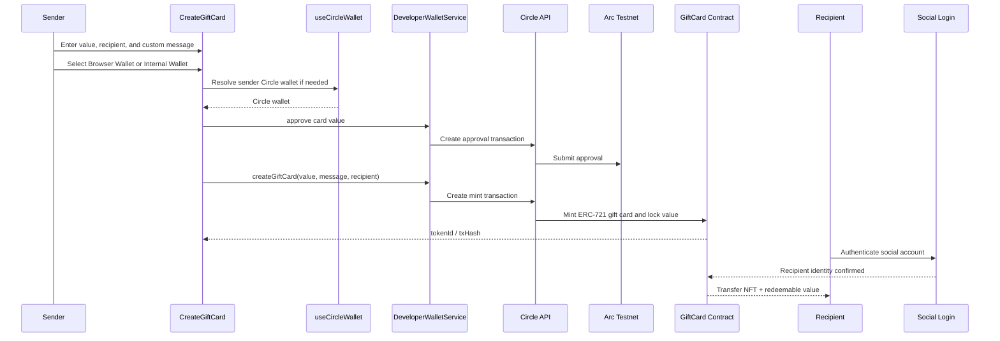
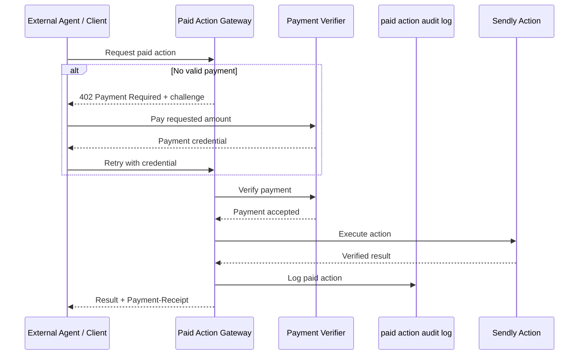

# Sendly Architecture

Sendly is a USDC-first payment product for sending money to a social username instead of a wallet address. The current architecture combines Web2-style identity, Circle Developer-Controlled Wallets, Arc Testnet contracts, CCTP Bridge Kit, zkTLS payments, and NFT Gift Cards.

The product goal is to hide wallet addresses, chain choice, gas tokens, and bridge complexity from end users while still keeping payments auditable on-chain.

## Implemented Now

| Area | Status | Main implementation |
|---|---|---|
| NFT Gift Card creation | Implemented | Circle wallet approve + ERC-721 mint on Arc Testnet |
| Circle Developer-Controlled Wallets | Implemented | `DeveloperWalletService`, backend Circle API calls |
| Bridge Kit / CCTP | Implemented | `@circle-fin/bridge-kit` + viem adapter |
| Payments via zkTLS | Implemented | `zkSEND` contract + social identity hash + zkTLS verification |

## Planned Next

| Area | Status | Notes |
|---|---|---|
| Circle Agentic Stack: Gateway | Frontend and backend implemented, testing in progress | Gateway UI, direct frontend flow, Supabase backend with Unified Balance Kit |
| Circle Agentic Stack: Agent Wallet | Planned | Agent wallet flow for automated and policy-controlled payments |
| Circle Agentic Stack: x402 Nanopayments | Planned | HTTP 402 paid-action flow for agent and API payments |
| Modular Wallet | Testing in progress | Passcode/passkey-based self-custody UX |

## High-Level System

## Identity and Wallet Resolution

The user connects one of their social accounts to Sendly, for example an account from Twitter/X, Telegram, GitHub, or another supported social network. Sendly stores the linked platform identity and uses it as the human-readable payment target.

The wallet layer resolves that connected social account to a Circle wallet through a fallback chain:

1. Connected wallet address, when the user already has an external wallet.
2. Linked social account: platform, social user ID, and username.
3. Privy user ID as the final identity anchor.

The resolved wallet metadata is stored in `developer_wallets`, including Circle wallet IDs, wallet set IDs, blockchain, account type, state, and social identity fields.

## zkTLS Direct Payments

zkTLS Direct Payments are instant private transfers to a social username. The sender enters a recipient handle and amount. The recipient later proves ownership of that social account with zkTLS, without sharing passwords or private credentials, and the proof is submitted on-chain to release the funds.

This mode is different from Gift Cards: no NFT card is created. The core asset is the locked payment in the `zkSEND` contract, keyed by the recipient's social identity hash.

The UI supports two payment sources:

- Browser Wallet: the user signs transactions with an injected wallet.
- Internal Wallet: Sendly uses the user's Circle Developer-Controlled Wallet.

For the internal wallet path, the frontend prepares contract calls and sends them through `DeveloperWalletService`. The backend keeps Circle credentials out of the browser.

## Circle Gateway and Unified Balance

Gateway is part of the next Circle Agentic Stack phase. The frontend and backend implementations already exist, and the feature is currently in testing.

Sendly has two Gateway implementations because they serve different execution contexts.

| Layer | Purpose | Implementation |
|---|---|---|
| Frontend Gateway | Interactive user wallet flow | Direct viem calls, EIP-712 signing, Gateway REST API |
| Backend Unified Balance | Server-side Circle wallet flow | Supabase Edge Functions with Unified Balance Kit |

The frontend flow is useful when the user signs in the browser. The backend flow is useful when Sendly operates through Circle Developer-Controlled Wallets and the entity secret stays server-side.

### Backend Unified Balance Flow

## CCTP Bridge Kit

Gateway is used for unified-balance transfers. Bridge Kit is used for direct CCTP bridging, for example Arc Testnet to Base Sepolia.

## NFT Gift Cards

NFT Gift Cards are a separate mode from zkTLS Direct Payments. In this flow, the sender creates a card with a custom message and USDC/AUSD value. The card is minted as an ERC-721 NFT, while the value stays locked until the recipient claims it.

The recipient authenticates through a social login flow and receives both the NFT card and the redeemable value. This mode is designed for gifts, tips, and personalized transfers where the message and card object matter as much as the payment.

## x402 Nanopayments Gateway

x402 Nanopayments are planned as part of the Circle Agentic Stack. External agents or clients will call a paid endpoint. If the request has no payment credential, the gateway responds with HTTP 402. After payment, the action executes and the result is returned with a payment receipt.

Target paid actions include recipient resolution, tip preparation, bulk tipping, zkTLS social resolve, and zkTLS claim preparation. Every paid action should be logged with amount, status, and correlation ID.

## Data Model Notes

The architecture relies on these important database areas:

- `developer_wallets`: Circle wallet ID, wallet set ID, wallet address, blockchain, account type, state, and social identity binding.
- Social identity columns: user type, social platform, social user ID, social username, and Privy user ID.
- Paid action audit log: payment action type, payment amount, status, and correlation ID.
